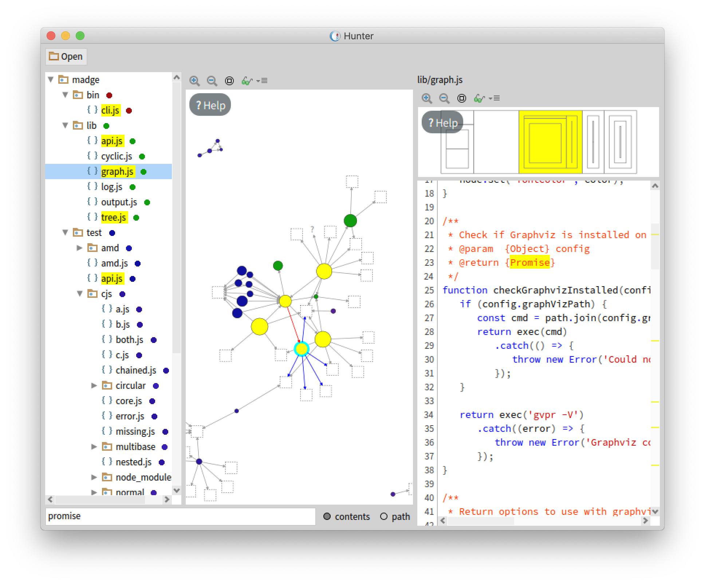

# Hunter

[](https://travis-ci.org/dorellang/hunter)

Hunter (standing for **H**unter **U**seful and **N**ice **T**ool for **E**CMAScript **R**eengineering) is a platform in development that helps programmers to understand JavaScript applications via interactive visualizations.

Hunter runs on top of [Pharo](http://pharo.org), the live programming environment.



## How to use

**Build Hunter**: Clone this repository and execute `./build.sh` in a terminal. It's a very simple process if your systems meets the requirements (see below).

**Start Hunter**: Once the build finished. Use `./start.sh`to open the application, where you can open a JavaScript project in two ways: click on the open button and choose the directory, or drag and drop it.

### System requirements

Hunter runs under Linux and OS X. Windows is not currently supported. Also you need to have [NodeJS](https://nodejs.org/en/) in your system (version >= 6).

**Note for linux 64-bits**: if you're running a 64-bit version of Linux (quite likely nowadays) you need to install the 32-bit versions of some libraries. This will do the work in Debian 8+ and Ubuntu 14.04+ (according to [the official Pharo docs](http://pharo.org/gnu-linux-installation)):

```
sudo dpkg --add-architecture i386 
sudo apt-get update
sudo apt-get install libx11-6:i386 
sudo apt-get install libgl1-mesa-glx:i386 
sudo apt-get install libfontconfig1:i386 
sudo apt-get install libssl1.0.0:i386
sudo apt-get install libcairo2:i386
```

## Development

There are two main alternatives to get a Pharo image with Hunter loaded on it:

* Execute `./build.sh --dev` in a terminal, then execute `./pharo-ui Pharo.image`.
* Download a Pharo 7 image by yourself, then load the BaselineOfHunter.

For the second alternative, you can evaluate the following inside Pharo:

```smalltalk
Metacello new
	baseline: 'Hunter';
	repository: 'github://dorellang/hunter:master/src';
	load.
```
